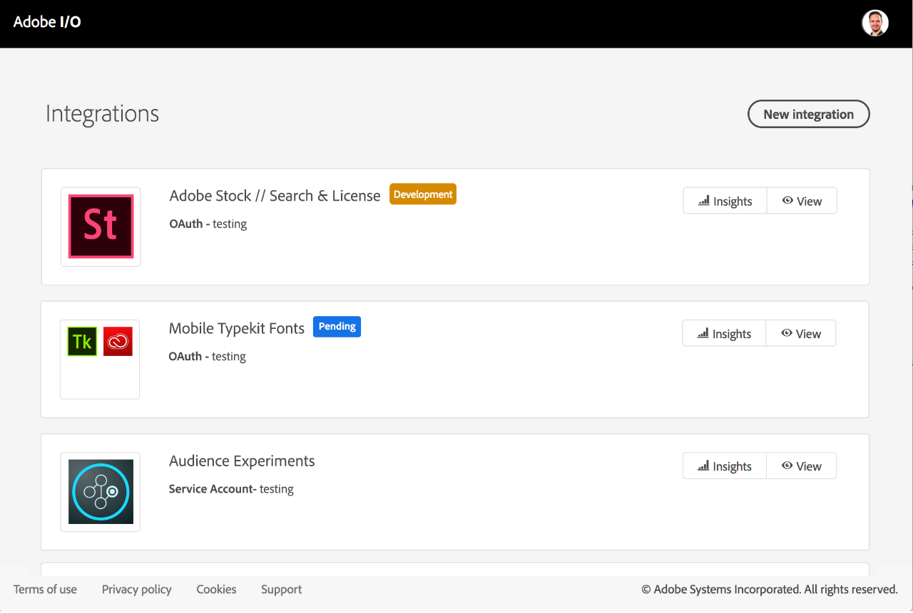
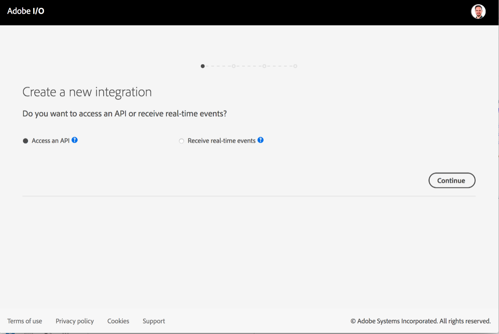
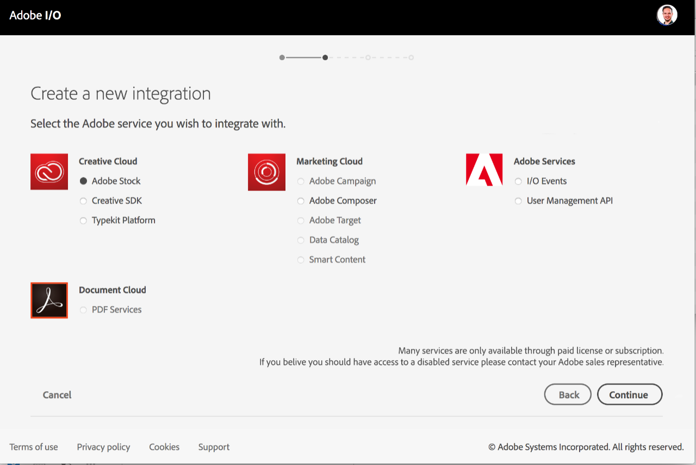
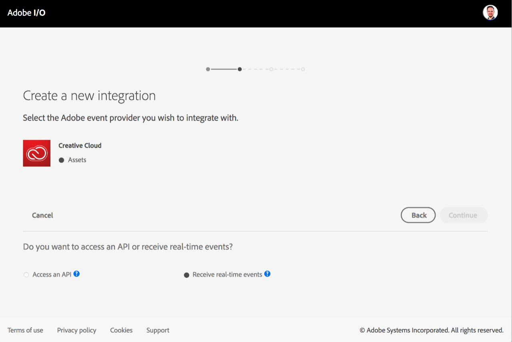
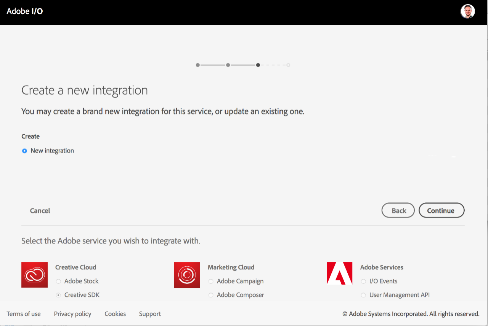
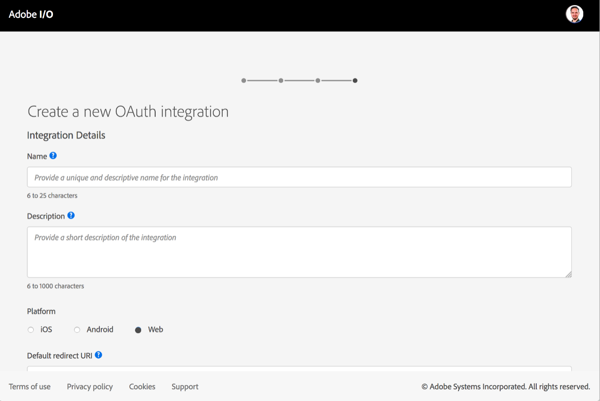

# API Key Integration

If your application needs to access Adobe services or content, you&rsquo;ll need a set of client credentials to authenticate the application and user, and authorize access. The type of integration you are building and the services you want to access will determine the type of client credentials you will need.

A small collection of Adobe services require authorization, but do not require authentication. These services can be called “anonymously,” and typically provide consistent results regardless of the application or user that made the request. An API Key is the only client credential required for these services. These integrations do not need to pass an access token with each request.

This article will walk you through the steps to set up an API Key integration.

To obtain an API Key, you&rsquo;ll need to create an API Key Integration using the [Adobe I/O Console](https://console.adobe.io/), as described here.
If your integration needs to access Adobe services or content on behalf of a user or an Adobe enterprise organization, it needs additional credentials for authentication. For more information, check out the articles on [OAuth Authentication](oauth_workflow.md) and [Service Account Authentication](jwt_workflow.md).

## API Key Integration Workflow

- [Subscribe to a Service or Event Provider](#step1subscribetoaserviceoreventprovider)
- [Configure an API Key Integration](#step2configureanapikeyintegration)
- [Secure your Client Credentials](#step3secureyourclientcredentials)

### Step 1: Subscribe to a Service or Event Provider
To create a new API Key integration, sign in to the [Adobe I/O Console](https://console.adobe.io/) with your Adobe ID, and click **New Integration.** (Notice that you may also choose existing integrations and edit their details from here.)

Choose the type of service you want to include in your integration. You can get API access to several Adobe services or subscribe to real-time events. An integration can access multiple services and event sources. Simply perform these steps for each service or event you want to add to your integration.

Select **Access an API** to create an integration that will access an Adobe product API or service, or select **Receive real-time events** to be notified of events in real time. You will have an opportunity to subscribe to additional services and events once you have created the integration.

- **Consume services**  
Services are the primary way your integration can access Adobe APIs and content. Some services are product specific, while other services provide unique functionality that can be used across products. We encourage you to mix and match services to build the best experience possible for your end users.

- **Subscribe to events**  
Adobe I/O Events allow you to build integrations that respond to changes in a users cloud data in real time. Select this option if your integration needs to instantly process content or data stored in an Adobe cloud. You must supply a **webhook,** which is the URL to which event notifications are sent.

Choose the service or event source that you would like to add to your integration. APIs and products available through Adobe I/O are typically listed by Cloud. However, some services span multiple clouds such as User Management and I/O Events.

Many services are only available through the purchase of a product, for example Adobe Campaign and Document Cloud PDF Services. If your organization has not been entitled to these services, the options are disabled. If you believe you should have access to a disabled service please contact your Adobe sales representative.

Some services (such as Adobe Stock) can be accessed with different types of authentication. For integrations that do not need to access services or content on behalf of a logged-in user or organization, select the API Key integration option.

If you are integrating with events, choose the event source.

If you have an existing integration that is compatible with the service you have selected, you can update that integration with access to the selected service.

To update an existing integration, simply select it and click Continue.
If you would like to create a brand new integration, select that option and click Continue.

### Step 2: Configure an API Key Integration

The configuration page lets you provide all of the required details for a new integration, or add new information to update an existing integration. On this page:

- Enter an **Integration Name** and **Description**. If you have multiple applications or access multiple services, you can use these properties to better organize your integrations.

    **Tip:** Give your integrations accurate and descriptive names. Integrations are shared with developers within your organization, so choose a name that is clear and easily understood. Generic names like My Test App are discouraged.

- Prove that you are not a robot. If you are a robot, please contact the Adobe I/O team to negotiate a peaceful alternative to your impending rebellion against humanity.

- Click **Create integration.**

When creation is confirmed, visit the overview section for your new integration. The overview section contains the newly generated API Key, and allows you to subscribe to additional services or events.

### Step 3: Secure your Client Credentials

Each integration contains a unique set of generated client credentials. These credentials are used to identify your application and grant API access to Adobe services.

The API Key (or Client ID) should be considered public information. It is passed with every API request to identify your integration.